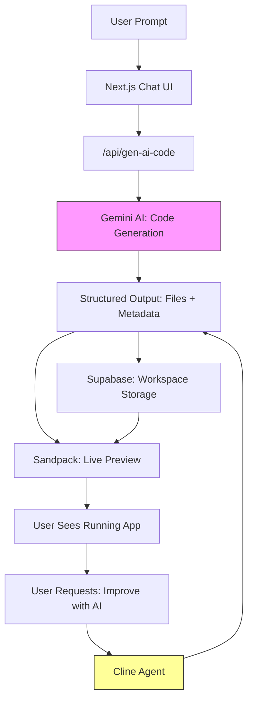

🚀 Agentic AI App Builder

Turn natural language into production-ready full-stack applications — instantly.
AI doesn’t just generate code — it plans, writes, improves, and debugs entire apps autonomously.

Built with Next.js + Gemini AI + Supabase + Agentic tooling, inspired by platforms like Bolt.new and Lovable.

⚡ What this is

Type a prompt like:

“Build a SaaS dashboard with auth, pricing, and analytics”

And the system will:
# AI Website Builder

Turn natural language prompts into production-ready full-stack applications using agentic AI.

This repository contains a Next.js app that demonstrates an agent-driven pipeline: generate, run, fix, and improve apps automatically with AI.

## Features

- Project-first code generation (not just snippets)
- Persistent workspace state and chat history
- Live preview via Sandpack
- Autonomous improvement agents (Cline SDK)
- AI-driven debugging and fixes
- Auth, billing, and credit system integrations

## Architecture (visual)



## Quickstart

1. Install dependencies

```bash
npm install
```

2. Generate Prisma client and push schema

```bash
npx prisma generate
npx prisma db push
```

3. Run the development server

```bash
npm run dev
```

4. Open http://localhost:3000

## Environment variables

Create a `.env.local` file at the project root and provide the following values:

- `NEXT_PUBLIC_CLERK_PUBLISHABLE_KEY`
- `CLERK_SECRET_KEY`
- `NEXT_PUBLIC_SUPABASE_URL`
- `NEXT_PUBLIC_SUPABASE_ANON_KEY`
- `DATABASE_URL`
- `GEMINI_API_KEY`
- `ARCJET_KEY`

## Project layout

- `app/` — Next.js App Router pages and API routes
- `components/` — React UI components
- `lib/` — helper utilities and server code
- `prisma/` — Prisma schema and migrations
- `public/` — static assets
- `types/` — TypeScript types

## Development notes

- The AI generation endpoint lives at `app/api/gen-ai-code/route.ts`.
- Workspaces, messages, and generated file data are persisted via Supabase (see `lib/prisma.ts` and `lib/server.ts`).

If you change database schemas, run `npx prisma migrate` or `npx prisma db push`.

## Contributing

Contributions are welcome. For major changes, open an issue first to discuss the design.

1. Fork the repo
2. Create a branch: `git checkout -b feat/your-feature`
3. Install and run locally
4. Send a PR

## License

This project is provided as-is. Add your preferred license.

---

If you'd like, I can also generate a one-page architecture PNG or improve any specific section (setup, deployment, or contributor guide). Would you like that?